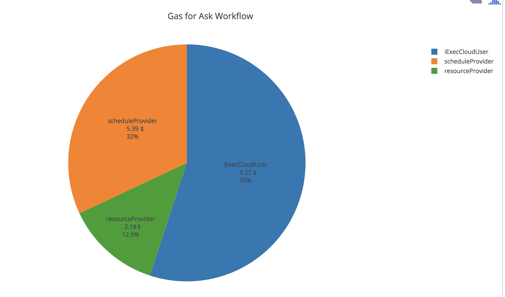
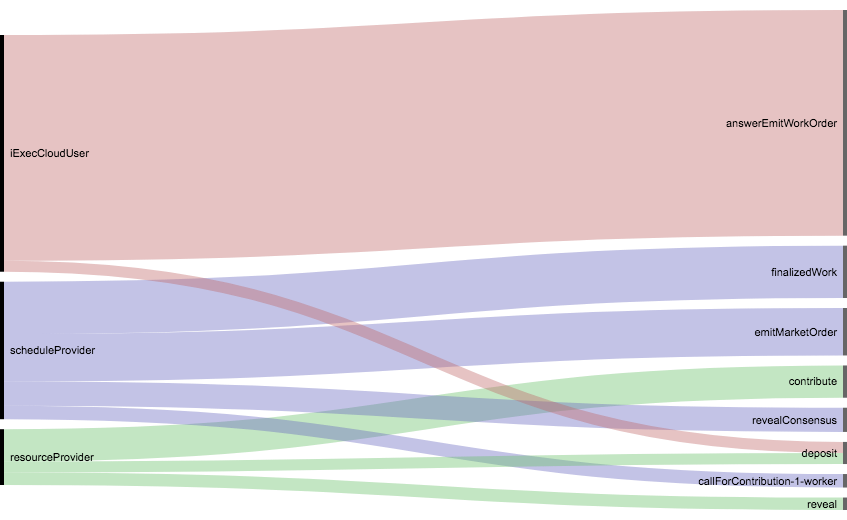

# Gas cost analysis

- gas usage are extract from a truffle test : [gasbyActorsForMinimalAskWorkflow.js](./gasbyActorsForMinimalAskWorkflow.js)
- This test covers the creation from scratch of the market place (init) and the a nominal ask workflow is done on it (askWorkflow).
- This test produces json files with transactions cost : [allTransactionsCostTab.json](./allTransactionsCostTab.json),
[asktransactionsCostTab.json](./asktransactionsCostTab.json),
[inittransactionsCostTab.json](./inittransactionsCostTab.json)

- We take <b> the Median Gas Price from  Last 1,500 blocks : 10 gwei</b>. See here :
https://ethgasstation.info/

- 1 eth = 1000000000 gwei = <b> 850 $</b> today

## Ask workflow gas cost by actors

|spendBy|when|gas|cost (gwei)  |dollars|
| ---------------- |:-----------:| -------------:|-----------:|-----------:|
|iExecCloudUser|askWorkflow|1091274|10912740|9,28$
|scheduleProvider|askWorkflow|633844|6338440|5,39$
|resourceProvider|askWorkflow|257182|2571820|2,19$

Total gas cost by actors for Ask Workflow :

Gas usage by actors and functions for Ask Workflow :

## MarketPlace Initilization gas cost by actors

|spendBy|when|gas|cost (gwei)  |dollars|
| ---------------- |:-----------:| -------------:|-----------:|-----------:|
|marketplaceCreator|init|10581893|105818930|127,93$
|scheduleProvider|init|3962178|39621780|33,68$
|resourceProvider|init|219609|2196090|1,87$
|appProvider|init|2046942|20469420|17,40$

Total gas cost by actors for Initilization :

Gas usage by actors and functions for Initilization :

## All transactions details

| spendBy          | when        | function      | gas        | cost (gwei)| dollars  |
| ---------------- |:-----------:| -------------:|-----------:|-----------:|-----------:|
|marketplaceCreator|init     |newWorkerPoolHub|4468567|44685670|37,98$
|marketplaceCreator|init|newAppHub|1962021|19620210|16,67$
|marketplaceCreator|init|newDatasetHub|1962749|19627490|16,68$
|marketplaceCreator|init|newIexecHub|5822730|58227300|49,49$
|marketplaceCreator|init|WorkerPoolHubTransferOwnership|30707|307070|0,26$
|marketplaceCreator|init|AppHubTransferOwnership|30685|306850|0,26$
|marketplaceCreator|init|DatasetHubTransferOwnership|30729|307290|0,26$
|marketplaceCreator|init|newMarketplace|678361|6783610|5,76$
|marketplaceCreator|init|attachMarketplace|63911|639110|0,54$
|scheduleProvider|init|createWorkerPool|3916971|39169710|33,29$
|scheduleProvider|init|updateWhitelist|45207|452070|0,38$
|resourceProvider|init|deposit|80992|809920|0,68$
|resourceProvider|init|subscribeToPool|138617|1386170|1,17$
|appProvider|init|newApp|2046942|20469420|17,39$
|scheduleProvider|askWorkflow|emitMarketOrder|218803|2188030|1,85$
|iExecCloudUser|askWorkflow|deposit|50992|509920|0,43$
|iExecCloudUser|askWorkflow|answerEmitWorkOrder|1040282|10402820|8,84$
|scheduleProvider|askWorkflow|callForContribution-1-worker|62179|621790|0,52$
|resourceProvider|askWorkflow|deposit|50992|509920|0,43$
|resourceProvider|askWorkflow|contribute|148713|1487130|1,26$
|scheduleProvider|askWorkflow|revealConsensus|111572|1115720|0,94$
|resourceProvider|askWorkflow|reveal|57477|574770|0,48$
|scheduleProvider|askWorkflow|finalizedWork|241290|2412900|2,05$

