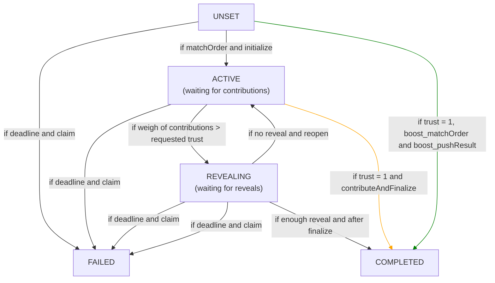
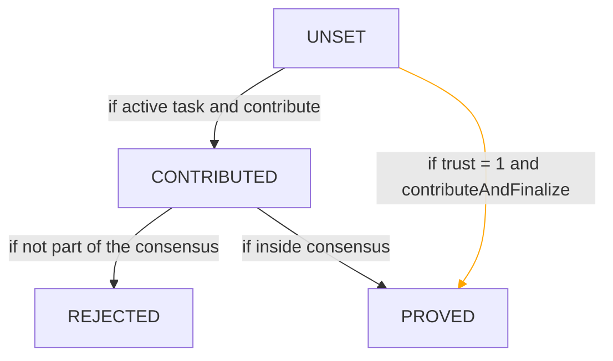

## Task statuses 

Flows:
- Nominal
- "Contribute and finalize"
- Boost

## Contributions statuses

- Nominal and "contribute and finalize" flows

- Boost flow

No contributions statuses in Boost flow.
